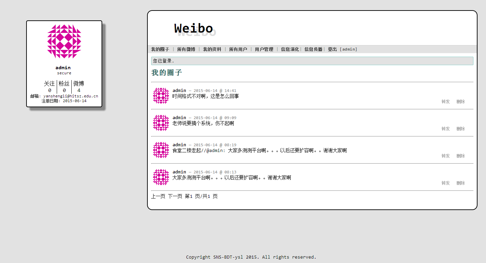
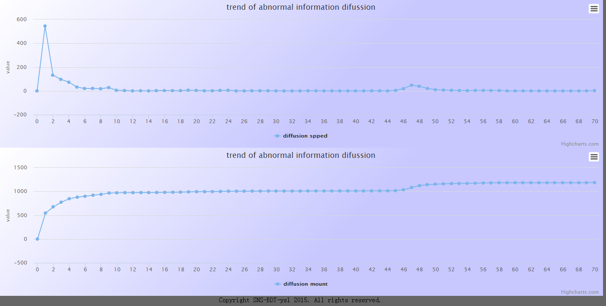

weibo
========

基于Flask的微博系统，实现了基本的微博功能。

数据库采用SQLite3，用户头像采用[http://www.gravatar.com](http://en.gravatar.com/site/implement/hash/)提供的用邮箱的哈希值生成的url。

功能:

* 用户注册、登录
* 发表、转发微博
* 查看用户资料
* 查看用户关注、粉丝名单
* 查看我的圈子的动态
* 采用d3.js展示信息传播过程
* 采用highcharts展示信息演化速度

DEMO:

flask-web-application
microblog application with flask

build a web-application based on nginx+flask+uwsgi+sqlachmey if you want to use this demo,you should first configure the following environment:

1.python2.7

2.nginx+uwsgi-python-plugin

3.install sqlachme

we have some functions:

1.post microblog,follow a person,show microblog of your friends

3.show following list and fans list

2.delete your microblog,update your microblog

we use html5+jina2 web template to show our application